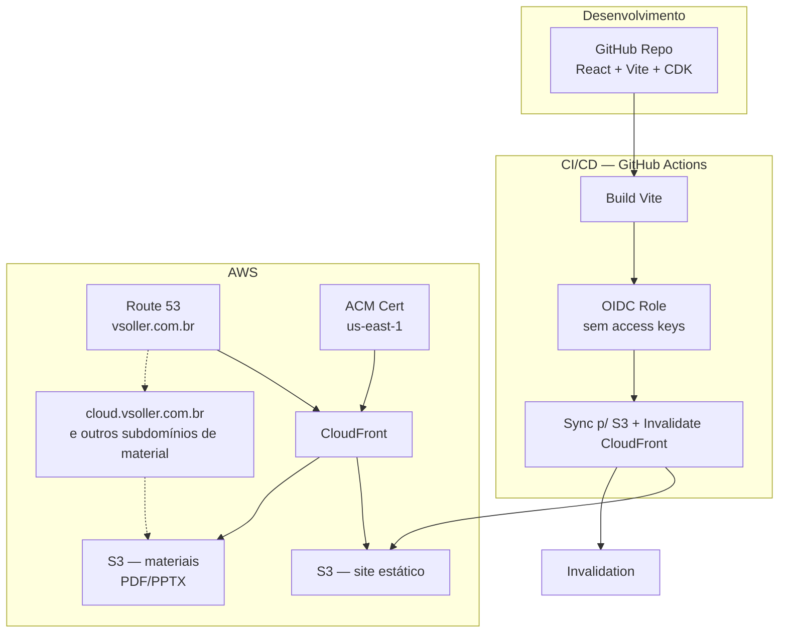

# Roadmap — Portfólio Vitor Soller

## Contexto

Perfil levantado a partir do GitHub ([@vgsstudio](https://github.com/vgsstudio)) e LinkedIn:

- **Vitor Guirão Soller** — Engenheiro da Computação (Instituto Mauá de Tecnologia), Analista de Projetos na **Dati** (Cloud | AI | Dados), ex-estagiário na Claro Flex.
- **TCC (2025):** *"Introdução à Computação Quântica com Raspberry Pi"* — estudo teórico + simulador prático com Qiskit, algoritmo de Shor, uso de hardware real IBM Quantum. Projeto em equipe ("quantumbros" com João Vitor Choueri Branco, orientação do Prof. Dr. Sandro Martini). **→ Projeto de destaque nº 1 do portfólio.**
- **Organização de eventos técnicos:** artigo no Medium sobre o *"Dev In The Dark"* (competição de frontend às cegas, Instituto Mauá, 2024), já usando S3 + CloudFront + Route 53 para publicar o site vencedor em tempo real. **→ Boa entrada para a seção de Palestras/Eventos.**
- Demais repositórios são majoritariamente exercícios/challenges (frontend mentor, cursos) — **não entram** como projetos de destaque, só o TCC quântico.

## Decisões de arquitetura confirmadas

| Decisão | Escolha |
|---|---|
| Upload de materiais | **Content-as-code**: metadados em JSON/Markdown versionados no repo; arquivos binários (PPT/PDF) sobem via `aws s3 cp` para um bucket dedicado. Sem backend, sem custo extra. |
| IaC | **AWS CDK (TypeScript)** — mesma linguagem do frontend. |
| Domínio | `vsoller.com.br` já registrado **e já com hosted zone no Route 53** — pula etapa de migração de DNS. |

## Arquitetura



- **Frontend:** React + Vite + TypeScript, sem SSR (SPA estática — não precisa de servidor).
- **Hosting:** S3 (privado) + CloudFront (OAC) + ACM (certificado em `us-east-1`, exigido pelo CloudFront) + Route 53 (registro alias).
- **IaC:** AWS CDK v2, stacks separadas: `CertStack` (us-east-1) e `SiteStack` (S3 + CloudFront + Route53).
- **CI/CD:** GitHub Actions autenticando via **OIDC** (sem access keys de longa duração) — build → `s3 sync --delete` → `cloudfront create-invalidation`.
- **Materiais de palestra:**
  - Tipo **HTML próprio** (ex: `cloud.vsoller.com.br`) → site estático separado, linkado externamente na seção de Palestras. Reaproveita o padrão que você já validou no Dev In The Dark.
  - Tipo **arquivo** (PPT, PDF) → bucket S3 dedicado (`materiais.vsoller.com.br` ou path `/materiais/` no CloudFront principal), referenciado por URL no JSON de conteúdo.
- **Custo estimado:** hosted zone (~US$0,50/mês) + S3/CloudFront/transferência para tráfego de portfólio pessoal → **na faixa de US$1–3/mês**, dentro do free tier na maior parte.

## Estrutura de conteúdo do site

1. **Hero** — nome "Vitor Soller" em destaque grande + foto ao lado, cargo atual, CTA (contato/CV).
2. **Sobre** — bio curta, stack de interesse (Cloud | AI | Dados).
3. **Experiência** — timeline (Claro Flex → Dati).
4. **Projetos** — TCC de Computação Quântica em destaque + 1–2 outros projetos relevantes (a curar).
5. **Certificações AWS** — grid de badges (linkando para Credly/verificação).
6. **Palestras & Materiais** — cards por evento/palestra, com link externo (HTML) ou download (PDF/PPT).
7. **Contato** — links GitHub/LinkedIn/e-mail.

### Modelo de dados (content-as-code)

```json
// src/content/talks.json
[
  {
    "slug": "dev-in-the-dark-2024",
    "title": "Dev In The Dark",
    "date": "2024-06-29",
    "type": "evento",
    "description": "Competição de frontend às cegas — organização e infra (S3+CloudFront+Route53).",
    "links": [{ "label": "Post no Medium", "url": "https://medium.com/@vitorsoller/..." }]
  },
  {
    "slug": "tcc-computacao-quantica",
    "title": "Introdução à Computação Quântica com Raspberry Pi",
    "date": "2025-08-30",
    "type": "material",
    "fileUrl": "https://materiais.vsoller.com.br/tcc-computacao-quantica/tcc.pdf"
  }
]
```

Adicionar um material novo = editar este JSON + `aws s3 cp arquivo.pdf s3://materiais.vsoller.com.br/...` + commit/push (o CI cuida do resto).

## Stack técnico sugerido

- Vite + React + TypeScript
- Tailwind CSS
- Framer Motion (animações de entrada/scroll)
- lucide-react (ícones)
- Uma página só, navegação por âncora (não precisa de router)

## Fases do roadmap

- [x] **Fase 0 — Conteúdo (não-técnico):** foto profissional, bio, textos de experiência, lista final de certificações AWS, curadoria de projetos e palestras/materiais. Tudo levantado em `info-vitor/perfil.md`.
- [x] **Fase 1 — Design:** tema dark com acentos laranja/azul, tipografia Inter, Hero com nome grande + foto + mosaico de certificações logo abaixo.
- [x] **Fase 2 — Scaffold frontend:** Vite + React + TS + Tailwind v4 + Framer Motion em `web/`, todas as seções com conteúdo real (Sobre, Experiência, Projetos, Certificações, Palestras, Contato).
- [x] **Fase 3 — Infra base (CDK):** `infra/` — `CertStack` (ACM us-east-1) + `SiteStack` (S3 + CloudFront OAC + Route53 alias A/AAAA para apex e www) — **deployado na conta pessoal (605914448173, profile `personal-vitor`)**. Site no ar em https://vsoller.com.br.
- [x] **Fase 4 — CI/CD:** `GithubOidcStack` (role `github-actions-portfolio-deploy`, trust restrito a `VgsStudio/portfolio@main`) + `.github/workflows/deploy.yml` (build → `cdk deploy --all`, sem access keys). Push em `main` deploya automaticamente.
- [ ] **Fase 5 — Conteúdo como código:** hoje o conteúdo é hardcoded em TS (`web/src/data/certifications.ts`, `experience.ts`, `talks.ts`, e inline em `Projects.tsx`); falta extrair pra JSON versionado conforme o modelo content-as-code acima, e criar o bucket de materiais (PDF/PPT) para o TCC e futuros itens.
- [ ] **Fase 6 — Polish adicional:** SEO (meta tags, OG image, sitemap), analytics leve, acessibilidade (contraste, `alt` em imagens, navegação por teclado).
- [ ] **Fase 7 — Lançamento:** revisão final de conteúdo, teste em mobile, compartilhar no LinkedIn/GitHub.

### Como fazer deploy hoje

Automático: push em `main` dispara o workflow `deploy.yml` (build + `cdk deploy --all` via OIDC).

Manual (fallback local):

```bash
cd web && npm run build
cd ../infra && npx cdk deploy --all --profile personal-vitor
```

**Importante:** este projeto usa exclusivamente o profile AWS `personal-vitor` (conta pessoal 605914448173). Nunca usar outro profile — a máquina tem acesso a várias contas de clientes da Dati.

## Próximos passos imediatos

Fases 0–4 concluídas: site no ar em https://vsoller.com.br, repo publicado em [VgsStudio/portfolio](https://github.com/VgsStudio/portfolio), deploy automático via GitHub Actions validado ponta a ponta.

1. **Fase 5 — Conteúdo como código:** extrair `certifications.ts` / `experience.ts` / `talks.ts` / dados de projetos (hoje inline em `Projects.tsx`) para JSON em `web/src/content/`; criar o bucket S3 dedicado a materiais e subir os primeiros PDFs/PPTs do TCC.
2. **Fase 6 — Polish:** meta tags OG/Twitter, `sitemap.xml`, favicon, checagem de acessibilidade.
3. **Fase 7 — Lançamento:** revisão final e divulgação.

### Nota técnica — OIDC e sub claim do GitHub

A trust policy do `GithubOidcStack` usa o valor exato da claim `sub` que o GitHub envia, incluindo os IDs imutáveis de owner/repo (`repo:VgsStudio@81604963/portfolio@1324538764:ref:refs/heads/main`), não só os nomes. Se o `AssumeRoleWithWebIdentity` voltar a falhar com `AccessDenied` após um rename/transfer do repo, confira o valor real em um evento `AssumeRoleWithWebIdentity` no CloudTrail (`userIdentity.userName`) antes de mexer na policy.
